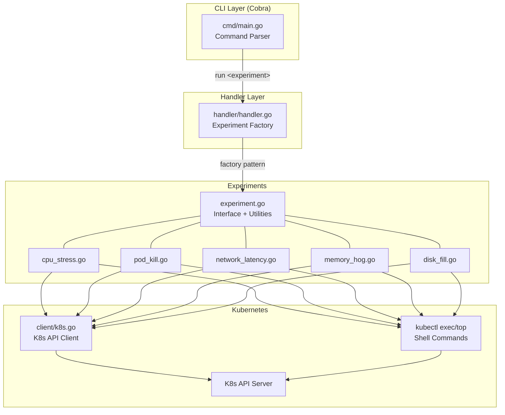
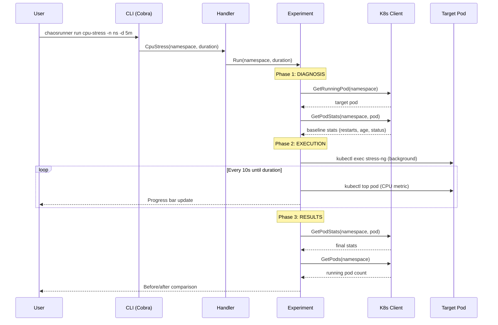

# ChaosRunner 🔥

<div align="center">

[](https://golang.org)
[](LICENSE)
[](https://kubernetes.io)

**Kubernetes Chaos Engineering CLI - Inject faults and test system resilience**

</div>

## Overview

ChaosRunner is a lightweight chaos engineering CLI for Kubernetes. It injects failures into running pods to test how your system handles stress, outages, and resource pressure.

## Quick Start

### Prerequisites

- Go 1.25+
- `kubectl` configured and in PATH
- Access to a Kubernetes cluster
- Metrics Server installed (optional, for CPU/memory monitoring)

### Installation

```bash
# Build from source
git clone https://github.com/dablon/chaosrunner.git
cd chaosrunner
go build -o chaosrunner ./cmd

# Move to PATH
sudo mv chaosrunner /usr/local/bin/
```

### Run Your First Experiment

```bash
# List available experiments
chaosrunner list

# Run CPU stress against a namespace
chaosrunner run cpu-stress -n my-namespace -d 5m
```

## Available Experiments

| Experiment | Description | Impact |
|------------|-------------|--------|
| `pod-kill` | Kill random pods and measure recovery time | Medium |
| `network-latency` | Inject network delay via `tc` inside containers | Low-Medium |
| `cpu-stress` | Stress CPU cores via `stress-ng` with real-time monitoring | High |
| `memory-hog` | Consume memory inside a container | High |
| `disk-fill` | Fill ephemeral storage with `dd` | Critical |

## Command Reference

### `chaosrunner run <experiment>`

Run a chaos experiment against a namespace.

**Flags:**

| Flag | Short | Default | Description |
|------|-------|---------|-------------|
| `--namespace` | `-n` | `default` | Target Kubernetes namespace |
| `--duration` | `-d` | `5m` | Experiment duration (Go duration format: `30s`, `5m`, `1h`) |

### `chaosrunner list`

List all available experiments.

### `chaosrunner version`

Print the current version.

## Experiment Details

### CPU Stress

Runs `stress-ng` inside a target pod with 4 CPU workers. Includes a real-time progress bar with live CPU metrics from `kubectl top`.

**Stress tool fallback chain:**
1. `stress-ng` (if already installed)
2. `stress` (if already installed)
3. Auto-install via `apt-get` (Debian/Ubuntu)
4. Auto-install via `apk` (Alpine)
5. Auto-install via `yum` (RHEL/CentOS)
6. Pure shell CPU burn (last resort, no tools needed)

If the stress tool exits early, it automatically retries up to 2 times. If all retries fail, it continues monitoring the pod for the remaining duration.

```bash
$ chaosrunner run cpu-stress -n chaos-test -d 5m

🔥 Running chaos experiment: cpu-stress
━━━━━━━━━━━━━━━━━━━━━━━━━━━━━━━━━━━━

📋 Experiment: cpu-stress
   Namespace: chaos-test
   Duration: 5m
   Stress workers: 4

🔍 DIAGNOSIS - Initial State:
   ✓ Target pod: nginx-test-566dbd78d4-b4t4c
      Status: Running
      Restarts: 0
      Age: 2m16s
   ✓ Namespace overview: 3 pods running

⚙️  EXECUTION - Starting CPU Stress:
   📊 CPU before stress: 0m
   🚀 Starting stress-ng (4 workers, 300s)...

   [██████████████████████████████] 100% | 5m0s/5m0s | CPU: 987m

   ✅ CPU stress completed

📈 RESULTS - After Stress:
   ✓ Target pod: nginx-test-566dbd78d4-b4t4c
      Status: Running
      Restarts: 0 (before: 0)
   📊 CPU after stress: 2m
   ✓ Final state: 3/3 pods running
   ✓ Duration: 5m

✅ Experiment completed successfully
   Duration: 5m
```

### Pod Kill

Selects random running pods in the namespace and deletes them. Measures termination and recovery time via ReplicaSet reconciliation.

```bash
$ chaosrunner run pod-kill -n chaos-test -d 5m
```

### Network Latency

Injects network delay using `tc` (traffic control) inside the target container. Automatically cleans up `tc` rules after the experiment.

```bash
$ chaosrunner run network-latency -n chaos-test -d 2m
```

### Memory Hog

Allocates memory inside a container using `stress-ng --vm`. Monitors for OOMKill events and pod restarts.

```bash
$ chaosrunner run memory-hog -n chaos-test -d 3m
```

### Disk Fill

Writes large files to the container's filesystem using `dd`. Monitors disk usage and pod eviction.

```bash
$ chaosrunner run disk-fill -n chaos-test -d 2m
```

## Architecture



### Experiment Execution Flow



### CPU Stress - Stress Tool Fallback


### Project Structure

```
chaosrunner/
├── cmd/
│   └── main.go                  # CLI entry point (Cobra commands)
├── internal/
│   ├── client/
│   │   └── k8s.go               # Kubernetes client (pod ops, stats)
│   ├── config/
│   │   └── config.go            # Configuration
│   ├── experiments/
│   │   ├── experiment.go        # Base interface & utilities
│   │   ├── cpu_stress.go        # CPU stress with progress bar
│   │   ├── memory_hog.go        # Memory pressure
│   │   ├── pod_kill.go          # Pod termination
│   │   ├── network_latency.go   # Network delay injection
│   │   └── disk_fill.go         # Disk pressure
│   └── handler/
│       └── handler.go           # Experiment factory & coordinator
└── go.mod
```

All experiments follow the same 3-phase pattern:
1. **DIAGNOSIS** - Capture baseline pod stats, namespace state
2. **EXECUTION** - Apply chaos + real-time monitoring with progress bar
3. **RESULTS** - Compare before/after, detect restarts, report

## Environment Variables

| Variable | Default | Description |
|----------|---------|-------------|
| `KUBECONFIG` | `~/.kube/config` | Path to Kubernetes config |

## Safety Guidelines

1. **Start in non-production namespaces** - Test in staging/dev first
2. **Set reasonable durations** - Don't run multi-hour stress on shared clusters
3. **Monitor your pods** - Have `kubectl get pods -w` running in another terminal
4. **Know your resource limits** - CPU/memory limits on pods affect experiment behavior

## Development

```bash
# Build
go build -o chaosrunner ./cmd

# Run tests
go test -v ./...
```

## License

MIT License - see [LICENSE](LICENSE)
