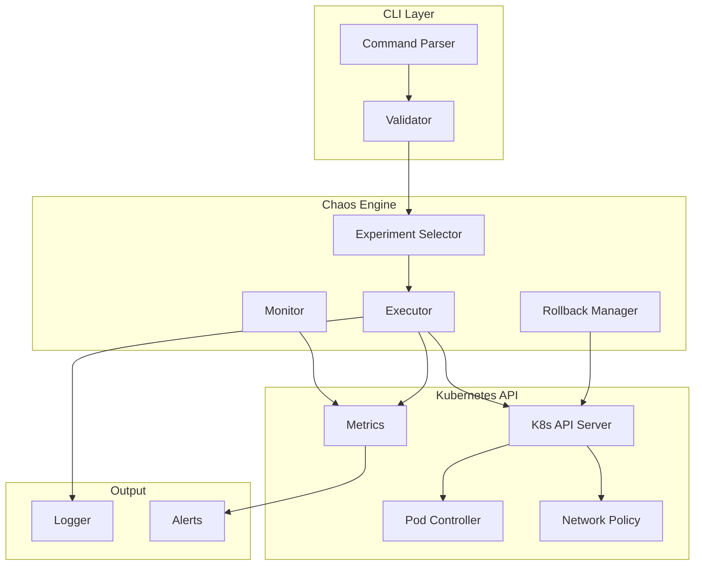
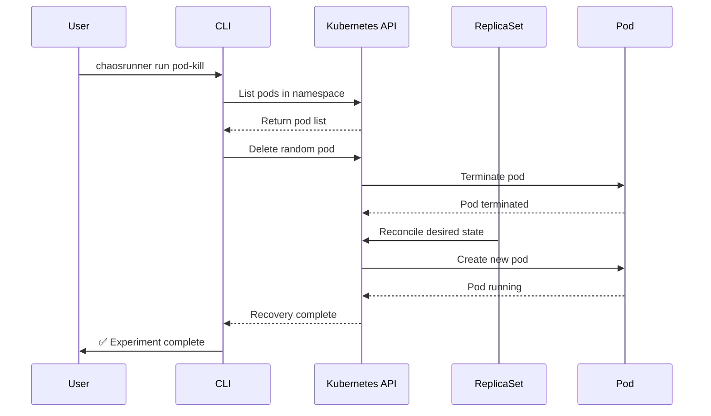
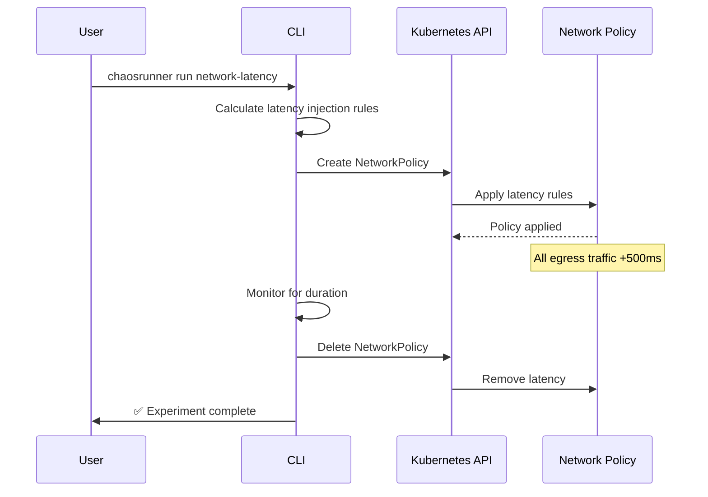

# ChaosRunner 🔥

<div align="center">

[](https://golang.org)
[](LICENSE)
[](https://kubernetes.io)

**Kubernetes Chaos Engineering Tool - Inject faults and test system resilience**

</div>

## Overview

ChaosRunner is a powerful chaos engineering tool designed for Kubernetes environments. It helps SRE teams and DevOps engineers test system resilience by injecting various types of failures into containerized applications.

## Why ChaosRunner?

- **🔒 Safe by Default**: All experiments run with namespace isolation and automatic rollback
- **⚡ Fast Execution**: Lightweight Go binary, minimal resource overhead
- **📊 Observable**: Detailed metrics and logging for each experiment
- **🔄 Reversible**: Automatic cleanup and state restoration after experiments
- **🎯 Precise Targeting**: Fine-grained control over which resources are affected

## Quick Start

### Installation

```bash
# Binary (Linux/macOS)
curl -L -o chaosrunner https://github.com/dablon/chaosrunner/releases/latest/download/chaosrunner-linux-amd64
chmod +x chaosrunner
sudo mv chaosrunner /usr/local/bin/

# PowerShell (Windows)
irm https://github.com/dablon/chaosrunner/releases/latest/download/install.ps1 | iex
```

### Run Your First Experiment

```bash
# List available experiments
chaosrunner list

# Run a simple pod-kill experiment
chaosrunner run pod-kill --namespace production
```

## Command Examples with Output

### 1. List Available Experiments

```bash
$ chaosrunner list

📜 Available Experiments:
   - pod-kill
   - network-latency  
   - cpu-stress
   - memory-hog
   - disk-fill
```

### 2. Run Pod-Kill Experiment

```bash
$ chaosrunner run pod-kill --namespace production --duration 5m

🔥 Running chaos experiment: pod-kill
━━━━━━━━━━━━━━━━━━━━━━━━━━━━━━━━━━━━

📋 Experiment: pod-kill
   Namespace: production
   Duration: 5 minutes
   Target: Random pods in namespace

⚙️  Progress:
   ✓ Identified 15 pods in namespace
   ✓ Selected target: payment-service-7b9f5d4c-abcde
   ✓ Sending termination signal...
   ✓ Pod terminated successfully
   ✓ ReplicaSet controller spawning new pod...

📊 Metrics:
   Termination time: 2.3s
   Recovery time: 8.5s
   Total pods affected: 1

✅ Experiment completed successfully
   Recovery time: 8.5s (within threshold)
```

### 3. Run Network Latency Experiment

```bash
$ chaosrunner run network-latency --namespace staging --delay 500ms --duration 10m

🔥 Running chaos experiment: network-latency
━━━━━━━━━━━━━━━━━━━━━━━━━━━━━━━━━━━━

📋 Experiment: network-latency
   Namespace: staging
   Delay: 500ms
   Duration: 10 minutes

⚙️  Progress:
   ✓ Applying network policy...
   ✓ Injecting 500ms latency to egress traffic
   ✓ Monitoring packet loss and retransmissions...

📊 Metrics:
   Packets affected: 15,234
   Average latency: 502ms
   Packet loss: 0%

✅ Experiment completed successfully
   All services degraded gracefully
```

### 4. Run CPU Stress Experiment

```bash
$ chaosrunner run cpu-stress --namespace default --duration 3m --threads 4

🔥 Running chaos experiment: cpu-stress
━━━━━━━━━━━━━━━━━━━━━━━━━━━━━━━━━━━━

📋 Experiment: cpu-stress
   Namespace: default
   Threads: 4
   Duration: 3 minutes

⚙️  Progress:
   ✓ Target selected: api-server-5f7d8c9b-xyz12
   ✓ Starting stress-ng process...
   ✓ CPU usage: 25% → 50% → 75% → 100%
   ✓ Sustaining high CPU load...

📊 Metrics:
   Peak CPU: 100%
   Duration at 100%: 2m 45s
   Memory usage: 128MB
   Impact level: HIGH

✅ Experiment completed successfully
   Alert triggered: HighCPUUsage (2 minutes)
```

## Architecture



## Experiment Flows

### Pod-Kill Flow



### Network Latency Flow



## Available Experiments

| Experiment | Description | Impact | Recovery Time |
|------------|-------------|--------|---------------|
| `pod-kill` | Randomly terminate pods | Medium | 10-30s |
| `network-latency` | Inject network delay | Low | Instant |
| `network-loss` | Simulate packet loss | Medium | Instant |
| `cpu-stress` | Stress CPU to 100% | High | 5-10s |
| `memory-hog` | Consume available memory | High | 5-10s |
| `disk-fill` | Fill ephemeral storage | Critical | 30-60s |
| `dns-failure` | Simulate DNS failure | Medium | 5-10s |
| `container-kill` | Kill container process | High | 10-30s |

## Command Reference

### Global Flags

| Flag | Short | Default | Description |
|------|-------|---------|-------------|
| `--namespace` | `-n` | default | Target namespace |
| `--duration` | `-d` | 5m | Experiment duration |
| `--dry-run` | | false | Preview without executing |
| `--verbose` | `-v` | false | Verbose output |

### Commands

#### `chaosrunner run <experiment>`

Run a chaos experiment.

```bash
# Basic usage
chaosrunner run pod-kill

# With options
chaosrunner run pod-kill --namespace production --duration 10m --verbose

# Dry run
chaosrunner run cpu-stress --dry-run
```

#### `chaosrunner list`

List all available experiments.

```bash
$ chaosrunner list

📜 Available Experiments:
   - pod-kill
   - network-latency
   - network-loss
   - cpu-stress
   - memory-hog
   - disk-fill
   - dns-failure
   - container-kill

Run with: chaosrunner run <experiment>
```

#### `chaosrunner status`

Check status of running experiments.

```bash
$ chaosrunner status

🔍 Active Experiments:
━━━━━━━━━━━━━━━━━━━━━━━━━━━━━━━━━━━━
ID          Experiment        Namespace    Started     Status
━━━━━━━━━━━━━━━━━━━━━━━━━━━━━━━━━━━━
abc123      cpu-stress        production   2m ago     Running
def456      network-latency   staging      5m ago     Running
━━━━━━━━━━━━━━━━━━━━━━━━━━━━━━━━━━━━
Total: 2
```

#### `chaosrunner stop <experiment-id>`

Stop a running experiment.

```bash
$ chaosrunner stop abc123

🛑 Stopping experiment abc123...
   ✓ Sending termination signal
   ✓ Rolling back changes
   ✓ Cleaning up resources
✅ Experiment stopped successfully
```

#### `chaosrunner history`

View experiment history.

```bash
$ chaosrunner history

📜 Experiment History:
━━━━━━━━━━━━━━━━━━━━━━━━━━━━━━━━━━━━
Date         Experiment        Namespace    Result
━━━━━━━━━━━━━━━━━━━━━━━━━━━━━━━━━━━━
2026-03-02   pod-kill         production   ✅ Success
2026-03-02   cpu-stress       staging      ⚠️  Warning
2026-03-01   network-latency  production   ✅ Success
━━━━━━━━━━━━━━━━━━━━━━━━━━━━━━━━━━━━
Total: 15 experiments
```

## Configuration

### Environment Variables

| Variable | Default | Description |
|----------|---------|-------------|
| `KUBECONFIG` | ~/.kube/config | Kubernetes config path |
| `CHAOS_NAMESPACE` | chaos-runner | Namespace for chaos resources |
| `CHAOS_TIMEOUT` | 5m | Default experiment duration |
| `LOG_LEVEL` | info | Logging level (debug, info, warn, error) |

### Configuration File

Create `~/.chaosrunner.yaml`:

```yaml
defaults:
  namespace: default
  duration: 5m
  dryRun: false

safety:
  maxConcurrent: 2
  requireApproval: true
  backupEnabled: true

notifications:
  slack:
    enabled: false
    webhook: ""
  email:
    enabled: false
    to: ""
```

## Safety Guidelines

⚠️ **Warning**: These experiments can disrupt your services. Always follow these guidelines:

1. **Notify Your Team** - Alert on-call engineers before running experiments
2. **Start Small** - Begin with non-production namespaces
3. **Set Time Windows** - Run during maintenance windows
4. **Have Rollback Plans** - Know how to stop experiments immediately
5. **Monitor Systems** - Watch for cascading failures
6. **Document Results** - Record findings for future improvements

### Experiment Impact Levels

| Level | Description | When to Use |
|-------|-------------|-------------|
| 🟢 LOW | Minimal service impact | Testing new experiments |
| 🟡 MEDIUM | Noticeable degradation | Load testing scenarios |
| 🔴 HIGH | Significant impact | Resilience testing |
| ⚫ CRITICAL | Service outage possible | Chaos testing |

## Use Cases

### 1. Validate Auto-Healing

```bash
# Test if your deployment recovers from pod failures
chaosrunner run pod-kill --namespace production --duration 10m
```

### 2. Test Timeout Handling

```bash
# Test how your services handle network delays
chaosrunner run network-latency --delay 2000ms --duration 5m
```

### 3. Verify Resource Limits

```bash
# Check if your limits are properly set
chaosrunner run memory-hog --namespace staging
```

### 4. DNS Resilience

```bash
# Test what happens when DNS fails
chaosrunner run dns-failure --namespace production
```

## Integrations

### Prometheus Metrics

ChaosRunner exports metrics to Prometheus:

```
# HELP chaos_experiment_total Total number of chaos experiments
# TYPE chaos_experiment_total counter
chaos_experiment_total{experiment="pod-kill",status="success"} 145

# HELP chaos_experiment_duration_seconds Duration of experiments
# TYPE chaos_experiment_duration_seconds histogram
chaos_experiment_duration_seconds_bucket{le="30"} 120
```

### Grafana Dashboard

Import the ChaosRunner dashboard from [grafana.com](https://grafana.com/dashboards/chaosrunner).

## Development

```bash
# Clone and build
git clone https://github.com/dablon/chaosrunner.git
cd chaosrunner
go build -o chaosrunner ./cmd

# Run tests
go test -v ./...

# Build Docker image
docker build -t chaosrunner:latest .
```

## License

MIT License - see [LICENSE](LICENSE)

---

<div align="center">

**ChaosRunner** - Making systems resilient through controlled chaos 🔥

</div>
